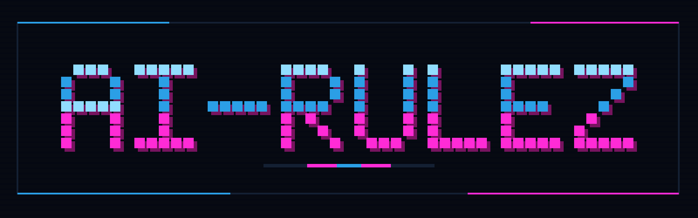

# AI-Rulez Documentation

<p align="center">
  
</p>

AI-Rulez is a CLI tool for managing AI assistant configurations across multiple tools.

Write your AI instructions once in a single configuration and generate tool-specific outputs for 52 harnesses, including Claude Code, Cursor, Codex, Copilot, Gemini CLI, OpenCode, Devin and Kilo. See [Supported harnesses](harnesses.md) for what each one receives.

## Core Concepts

### Directory-Based Configuration

Your configuration lives in `.ai-rulez/` with organized subdirectories:

- **rules/**: Mandatory constraints and standards
- **context/**: Reference documentation and architecture
- **skills/**: Specialized AI prompts for specific roles
- **agents/**, **commands/**: Subagents and slash commands
- **checks/**: [Code-review guidelines](checks.md)
- **domains/**: Team or subsystem-specific content
- **config.toml**: Main configuration (presets, profiles)

### Presets

Presets define how content is formatted and where it's output for different tools. There are 52 built-in
presets; the full list with the features each supports (rules folder, skills, agents, commands, MCP, hooks,
permissions, checks, user scope) is in [Supported harnesses](harnesses.md). A few examples:

- `claude` → generates `CLAUDE.md`, `.claude/rules/`, `.claude/skills/`, `.claude/agents/`
- `cursor` → generates `.cursor/rules/`
- `gemini` → generates `GEMINI.md`
- `copilot` → generates `.github/copilot-instructions.md` and `.github/instructions/`
- `devin` → generates `.devin/rules/`, `.devin/skills/`, `.devin/agents/`, `.devin/mcp_config.json`
- `codex` → generates `AGENTS.md`, `.agents/skills/`, `.codex/`
- `opencode` → generates `AGENTS.md`, `.opencode/`, `opencode.json`
- `junie` → generates `AGENTS.md` and `.junie/rules/`
- `hermes` → generates `.hermes.md`
- `xum` → generates `AGENTS.md` and `.xum/`
- `pi` → generates `AGENTS.md`, `.agents/skills/`, `.pi/agents/`, and `.pi/mcp.json`
- `baz` → generates what the [Baz](baz.md) reviewer reads: `AGENTS.md` (root and nested), `.agents/skills/`, `.claude/agents/`
- `okf` → an [Open Knowledge Format](okf.md) bundle of your rules, context and skills (`docs/okf/`), opt-in
- And 40 more, including `kilo`, `qwen`, `factory`, `goose`, `kiro`, `zed`, `warp` and `amp`.
- Custom tools: use a template preset or a [provider-backed preset](configuration.md#provider-backed-presets-full-parity) for full parity with built-ins.

### Profiles

Profiles let different teams generate customized outputs. Each profile specifies which domains to include:

```toml
[profiles]
full = ["backend", "frontend", "qa"]
backend = ["backend", "qa"]
frontend = ["frontend", "qa"]
```

## Quick Navigation

### Getting Started

- **[Installation Guide](installation.md)**: Install AI-Rulez and get started
- **[Getting Started Guide](quick-start.md)**: 5-minute quick start
- **[Configuration Reference](configuration.md)**: Complete guide to all config options

### Using AI-Rulez

- **[CLI Reference](cli.md)**: All commands and flags
- **[Supported Harnesses](harnesses.md)**: The 52 presets and the features each supports
- **[Includes System](includes.md)**: Reusing configurations across projects
- **[Checks](checks.md)**: Code-review guidelines for review tools
- **[Hooks, permissions and settings keys](settings.md)**: One `[[hooks]]` list and `[permissions]` block for every harness
- **[Permissions](permissions.md)**: The allow/ask/deny translation per harness
- **[User-level configuration](user-scope.md)**: `generate --user` for your home directory
- **[AGENTS.md and .agents/skills](agents-md.md)**: The `agents_md` flag: shared `AGENTS.md` and skills, tool support, per-preset output
- **[Local Configuration](local-overrides.md)**: Personal, gitignored machine-local content and config overlay
- **[Installed Skills](installed-skills.md)**: Installing skills from external repositories
- **[Poly Hooks](poly-hooks.md)**: Validate generated rules and plugins in Git hooks
- **[Domains & Profiles](domains.md)**: Organizing by team or subsystem
- **[Custom Presets](profiles.md)**: Creating custom output formats

### Advanced Topics

- **[MCP Server](mcp-server.md)**: Exposing configuration to AI assistants
- **[Examples](examples.md)**: Real-world configuration examples
- **[Schema Reference](schema.md)**: JSON schema details
- **[Monorepo](monorepo.md)**: Patterns for monorepos and large projects

## Typical Workflow

1. **Initialize** your project:

   ```bash
   ai-rulez init "my-project"
   ```

2. **Add content** to `.ai-rulez/`:
   - Write rules in `rules/`
   - Add context in `context/`
   - Create skills in `skills/`

3. **Generate outputs**:

   ```bash
   ai-rulez generate
   ```

4. **Commit** the sources:

   ```bash
   git add .ai-rulez/
   git commit -m "docs: update AI assistant guidelines"
   ```

   Generated files are gitignored by default (`gitignore = true`). Add them to the commit too only
   if you set `gitignore = false`.

## Key Features

- Single source of truth for all AI tool configurations
- Domain scoping to organize rules by team or subsystem
- Profile-based customization for different contexts
- Modular structure to reduce merge conflicts
- Built-in presets for 52 AI coding harnesses
- `[[hooks]]` and `[permissions]` written once and translated to each harness's native format
- Code-review `checks` for the review tools that read them
- User-level output (`generate --user`) for per-person configuration
- `generate --watch` for regeneration on save, and `ai-rulez doctor` for read-only diagnostics
- Comment-preserving merges into JSON, JSONC, TOML and YAML settings files you also edit by hand
- Custom presets for any tool and format
- Installed skills from external repositories
- Remote includes for sharing rules across projects
- MCP integration for programmatic access
- Support for monorepos and multi-team projects
- Optional shared `AGENTS.md` and `.agents/skills` for every tool that reads them (`agents_md`)
- Machine-local, gitignored content and config overlay (`config.local.*`, `.ai-rulez/local/`)

## Project Structure

After initialization, your project looks like:

```text
project-root/
├── .ai-rulez/
│   ├── config.toml           # Main configuration
│   ├── rules/                # Base rules (all profiles)
│   ├── context/              # Reference docs (all profiles)
│   ├── skills/               # AI skills (all profiles)
│   ├── agents/               # Agent prompt files (all profiles)
│   └── domains/              # Team-specific content
│       ├── backend/
│       └── frontend/
├── CLAUDE.md                 # Generated for Claude (context and agents; rules go to .claude/rules/)
├── .cursor/rules/            # Generated for Cursor
├── GEMINI.md                 # Generated for Gemini
└── .github/copilot-instructions.md
```

## Getting Help

- **CLI Help**: `ai-rulez --help`, `ai-rulez init --help`, etc.
- **Validation**: `ai-rulez validate` to check your configuration
- **Examples**: Check the [Examples](examples.md) section
- **Issues**: Report problems on [GitHub](https://github.com/Goldziher/ai-rulez)

## Version

This documentation covers **AI-Rulez V4** (TOML-based configuration with inline MCP servers and plugins).
